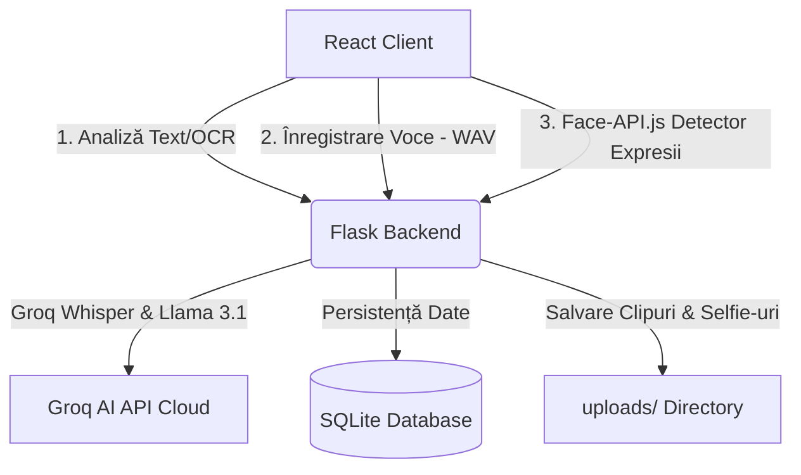

# Documentație Tehnică Completă: Sistemul Multimodal Anchor
Această documentație explică în detaliu arhitectura tehnică, fluxurile de date și modul de funcționare al sistemului de analiză psihologică multimodală (Text, Voce, Față) din cadrul aplicației **Anchor**.
---
## 1. Arhitectura Generală a Sistemului
Sistemul este construit pe o arhitectură de tip client-server modernă, formată din:
*   **Frontend (Client)**: O aplicație React 19 SPA (Single Page Application) cu Vite, responsabilă pentru interfața cu utilizatorul, randarea graficelor, captarea fluxului video de la webcam (folosind Face-API.js) și înregistrarea audio de la microfon.
*   **Backend (Server)**: Un server Flask în Python rulează în interiorul unui mediu virtual (`venv`). Acesta expune endpoint-uri REST securizate, procesează datele binare sau base64, rulează algoritmi acustici de extragere a trăsăturilor și orchestrează apelurile către rețelele neuronale (Groq API).
*   **Baza de date**: Un fișier SQLite local (`mindscan_history.db`) care reține istoricul sesiunilor (chat), datele analizelor text, parametrii faciali și înregistrările audio.

---
## 2. Modulul de Text: Comunicarea cu AI-ul
### Fluxul de Date
1. Utilizatorul introduce text manual sau încarcă o captură de ecran. Dacă încarcă o imagine, frontend-ul o trimite ca fișier `multipart/form-data` la `/analyze-text`.
2. Backend-ul utilizează **Tesseract OCR** (prin intermediul wrapper-ului `pytesseract`) pentru a extrage textul din imagine, dacă este prezent.
3. Serverul interoghează baza de date pentru a obține ultimele 3 schimburi de mesaje (`get_recent_context`) și calculul traiectoriei emoționale anterioare a pacientului.
4. Textul și contextul istoric sunt asamblate într-un Prompt securizat și trimise la **Groq API** folosind modelul `llama-3.1-8b-instant`.
### Integrarea AI (Prompt-ul Clinic)
AI-ul este instruit ca un psiholog clinician fin calibrat. Răspunsul este cerut în mod obligatoriu în format **JSON** cu următorul format:
*   `scor_intensitate_negativa`: Valoare între `0-10`.
*   `este_mascare_psihica`: `<bool>` indică dacă utilizatorul simulează o stare bună dar contextul anterior indică degradare.
*   `text_este_sarcastic` / `text_are_umor_negru`: Identifică mecanismele defensive de coping.
*   `feedback`: Text empatic, cald, personalizat, fără clișee.
### Formula de Scor Text
Backend-ul rulează o funcție de calibrare post-AI (`calculeaza_scor`):
*   **Zona 1 (0-30%)**: Tristețe normală.
*   **Zona 2 (30-70%)**: Stres moderat și depresie ușoară-medie.
*   **Zona 3 (70-100%)**: Depresie severă, ideație pasivă sau plan iminent.
*   **Algoritmul de Carantină**: Dacă scorul anterior al utilizatorului era $\ge 70\%$, algoritmul limitează scăderea bruscă a scorului la maximum $15\%$ pe mesaj, prevenind disimularea sau mascarea stării critice.
---
## 3. Modulul de Voce: Extragerea Trăsăturilor Acustice și Transcrierea
Modulul de voce analizează atât *ceea ce se spune* (transcrierea), cât și *cum se spune* (acustica vocii).
### Pasul 1: Înregistrare și Upload (Frontend)
Utilizatorul înregistrează vocea de la microfon printr-un `MediaRecorder` în format brut `audio/wav`, sau încarcă un fișier audio. Acest fișier este citit ca buffer binar, convertit în `base64` și trimis la endpoint-ul `/analyze-voice`.
### Pasul 2: Transcrierea (Groq Whisper)
Serverul trimite fișierul audio către modelul cloud **Whisper-large-v3** prin Groq pentru a obține o transcriere română de înaltă acuratețe, care este apoi trimisă modulului de text pentru analiză clinică.
### Pasul 3: Extragerea Trăsăturilor Acustice (`librosa`)
Serverul salvează audio pe disc și îl încarcă în librăria DSP `librosa` din Python pentru a extrage:
1.  **Energy (Amplitudinea medie)**: Persoanele depresive tind să vorbească cu energie scăzută (vocalizare plată).
2.  **Pace / Tempo (BPM)**: Ritmul lent al vorbirii este un indicator puternic de retard psihomotor (specific depresiei).
3.  **Zero Crossing Rate (ZCR / Claritatea)**: O rată mică indică o vorbire monotonă, neclară sau mormăită.
4.  **Spectral Centroid (Tone / Strălucire)**: Măsoară „luminozitatea” vocii. O valoare joasă indică o voce plată, lipsită de variație tonală.
### Calculul Scorului Vocal
Acuratețea este determinată de o formulă de agregare ponderată:
$$\text{Scor Vocal} = (\text{Scor Energie} \times 0.35) + (\text{Scor Ritm} \times 0.25) + (\text{Scor Claritate} \times 0.20) + (\text{Scor Ton} \times 0.20)$$
---
## 4. Modulul de Față: Recunoaștere și Analiză Biometrică
Modulul de față utilizează procesarea hibridă: detecția biometrică se face client-side (pentru performanță optimă în timp real), iar analiza clinică se face server-side.
### Pasul 1: Detecția pe Frontend (Face-API.js)
1.  La pornirea serverului Python, acesta copiază automat modelele pre-antrenate din `node_modules` în folderul `public/models` al aplicației.
2.  Aplicația React încarcă aceste modele locale (`tinyFaceDetector` și `faceExpressionNet`).
3.  Când utilizatorul face un selfie sau încarcă o imagine, Face-API rulează în browser și extrage un set de scoruri (de la 0 la 1) pentru 7 emoții de bază: *sad, happy, angry, fearful, neutral, disgusted, surprised*.
### Pasul 2: Procesarea pe Backend (`face.py`)
Frontend-ul trimite aceste scoruri de emoții brute către `/analyze-face`. Algoritmul din [face.py](file:///C:/Users/Podean%20Beniamin/Desktop/licenta/Anchor/anchorExe/backend/venv/face.py) procesează datele folosind următoarele modele matematice:
#### A. Modelul Continuu pentru Anhedonie
Anhedonia reprezintă incapacitatea de a simți plăcere (lipsa bucuriei). Pentru a evita salturile bruște în scor, am creat o funcție continuă:
$$I_{anhedonie} = \max(0, 100 - S_{happy} \times 1.5)$$
Unde $I_{anhedonie}$ este indicatorul de anhedonie, iar $S_{happy}$ este scorul de fericire exprimat în procente (0-100%). Dacă utilizatorul are peste $66\%$ fericire, indicatorul de anhedonie scade la $0\%$.
#### B. Ponderarea Indicatorilor Negativi
Calculăm un scor brut ($S_{brut}$) ponderând trăsăturile specifice corelate clinic cu stările depresive sau de anxietate:
$$S_{brut} = (S_{sad} \times 0.50) + (I_{anhedonie} \times 0.30) + (S_{anxiety} \times 0.20) + (S_{anger} \times 0.10) + (S_{numbness} \times 0.10)$$
Unde $S_{sad}$, $S_{anxiety}$, $S_{anger}$ și $S_{numbness}$ reprezintă scorurile pentru tristețe, anxietate, furie și stare neutră/apatie.
#### C. Filtrul de Suprimare Activă a Fericirii
Pentru a elimina erorile în care o persoană bucuroasă primea un scor de depresie facială (din cauza unor micro-expresii sau umbre), am implementat un factor de suprimare ($F_{suprimare}$):
$$F_{suprimare} = \max\left(0.0, 1.0 - \frac{S_{happy}}{60.0}\right)$$
$$S_{fata} = S_{brut} \times F_{suprimare}$$
Unde $S_{fata}$ este scorul final de risc depresiv facial. Dacă fericirea detectată depășește $60\%$, factorul devine $0$, iar scorul final de risc depresiv facial devine automat **$0\%$**.
---
## 5. Integrarea Multimodală (Scorul Combinat)
Când utilizatorul folosește în paralel mai multe modalități (de exemplu, o sesiune în care vorbește la microfon și are camera pornită), serverul agregă datele la endpoint-ul `/analyze-multimodal`.
### Ponderile de Agregare:
*   **Text (Limbaj)**: $50\%$ (Cea mai de încredere sursă, analizată de LLM-ul clinic).
*   **Voce (Acoustic)**: $25\%$ (Indicatori fizici și ritm).
*   **Față (Biometrie)**: $25\%$ (Expresia facială).
### Scorul de Încredere (Confidence Score):
Dacă toate cele trei modalități sunt prezente, sistemul calculează diferența maximă dintre ele pentru a evalua dacă indicatorii converg:
$$\text{Divergență Maximă} = \max(|T - V|, |T - F|, |V - F|)$$
$$\text{Scor Încredere (Confidence)} = \max(0, 100 - \text{Divergență Maximă})$$
Dacă toate modalitățile indică scoruri similare (de exemplu text=60%, voce=58%, fata=62%), încrederea este de peste $95\%$. Dacă sunt complet opuse (de exemplu, utilizatorul scrie că este foarte trist dar zâmbește larg la cameră), încrederea scade drastic, indicând disimulare sau mascare.
---
## 6. Persistența Datelor și Ștergerea Securizată
### Structura Bazei de Date (SQLite)
*   `voice_analysis`: Salvează ID-ul chat-ului, transcrierea, calea către fișierul audio `.wav`, scorul general de voce și trăsăturile DSP individuale (tempo, energy, etc.).
*   `face_analysis`: Salvează calea către selfie-ul `.jpg`, scorurile pentru fiecare din cele 7 emoții, indicatorii clinici detaliați și scorul final.
### Ștergerea Securizată (Privacy GDPR)
La solicitarea utilizatorului prin butoanele "Șterge Istoricul":
1.  **Ștergere Bază de Date**: Serverul execută instrucțiunea SQL `DELETE FROM table WHERE chat_id = ?`.
2.  **Curățare Hard Disk**: Backend-ul citește URL-urile imaginilor/clipurilor audio din baza de date înainte de ștergere, extrage numele fișierelor și le șterge fizic din folderul `uploads/` folosind biblioteca `os` din Python, eliberând spațiul și securizând datele.
---
## 7. Tehnologii și Unelte Utilizate
*   **Vite & React 19**: Framework frontend rapid, utilizând Hooks (`useState`, `useEffect`, `useRef`) pentru managementul camerelor web și al fluxurilor media.
*   **@vladmandic/face-api**: Wrapper modern pentru Tensorflow.js care rulează Tiny Face Detector direct în browser-ul utilizatorului.
*   **Flask & Flask-CORS**: Web framework Python utilizat pentru rutarea API-ului.
*   **Groq SDK & Groq Cloud**: Infrastructură LPU de ultra-mare viteză folosită pentru inferențele Llama 3.1 și Whisper.
*   **Librosa & NumPy**: Librării Python folosite pentru prelucrarea semnalelor digitale (DSP) și analiză acustică.
*   **Pytesseract & Tesseract OCR**: Motor de recunoaștere optică a caracterelor în imagini.
