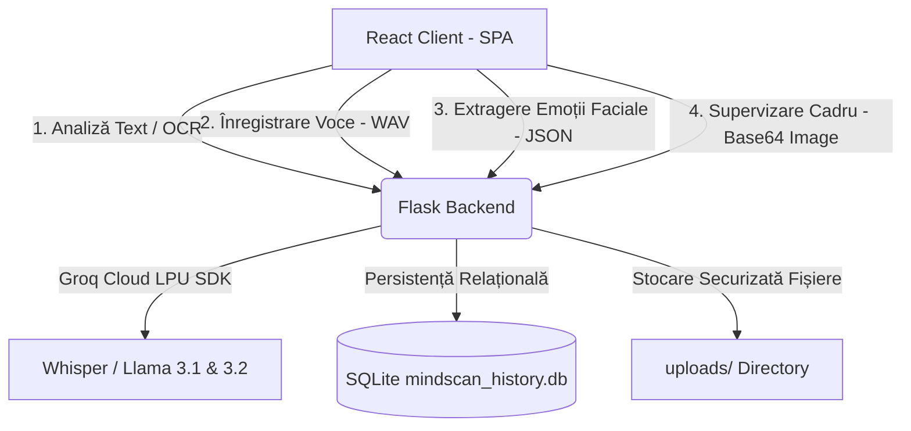

# ⚓ Anchor: Sistem Multimodal de Evaluare și Sprijin Psihologic

[](https://react.dev/)
[-green?style=for-the-badge&logo=flask)](https://flask.palletsprojects.com/)
[](https://www.sqlite.org/)
[](https://groq.com/)
[](https://www.upt.ro/)

**Anchor** este o platformă software avansată bazată pe o arhitectură client-server concepută pentru monitorizarea, analiza și evaluarea stării emoționale și psihologice a utilizatorilor. Sistemul funcționează prin corelarea și fuzionarea a trei canale senzoriale distincte (**Text**, **Voce** și **Față**) într-un **coeficient multimodal de risc**, oferind asistență empatică personalizată sau declanșând alerte de urgență în caz de pericol iminent.

---

## 📖 Cuprins
1. [Arhitectura Generală a Sistemului](#1-arhitectura-generală-a-sistemului)
2. [Modulul de Text: Analiză Semantică & Pragmatică](#2-modulul-de-text-analiză-semantică--pragmatică)
3. [Modulul de Voce: Prelucrare Paralingvistică DSP](#3-modulul-de-voce-prelucrare-paralingvistică-dsp)
4. [Modulul de Față: Biometrie Locală & Supervizare Vision](#4-modulul-de-față-biometrie-locală--supervizare-vision)
5. [Integrarea Multimodală & Scorul de Încredere](#5-integrarea-multimodală--scorul-de-încredere)
6. [Persistența Datelor & Politica de Confidențialitate (GDPR)](#6-persistența-datelor--politica-de-confidențialitate-gdpr)
7. [Ghid de Instalare & Configurare Pas cu Pas](#7-ghid-de-instalare--configurare-pas-cu-pas)
8. [Lansarea în Execuție](#8-lansarea-în-execuție)

---

## 1. Arhitectura Generală a Sistemului

Sistemul implementează o topologie modernă **hibridă Edge-Cloud**:
*   **Edge AI (Local pe Client)**: Mimica facială și detectarea expresiilor sunt procesate în timp real în browserul clientului folosind **TensorFlow.js (Face-API.js)**, garantând zero-lag și protecția datelor.
*   **Backend Orchestrator (Flask)**: Un server Python procesează datele primite, execută prelucrarea digitală de semnal acustic (DSP) și centralizează istoricul.
*   **Cloud Inference (Groq LPU)**: Asigură inferența modelelor de inteligență artificială generativă (**Whisper-large-v3**, **Llama 3.1 8B**, **Llama 3.2 11B Vision**) la latențe ultra-scăzute (< 500ms).



---

## 2. Modulul de Text: Analiză Semantică & Pragmatică

Modulul procesează textul introdus direct de utilizator sau extras automat din capturi de ecran folosind un motor de recunoaștere optică a caracterelor (**Tesseract OCR**).

### A. Fluxul de Date
1. Utilizatorul introduce un mesaj sau încarcă o captură de ecran (trimisă ca `multipart/form-data`).
2. Serverul rulează **pytesseract** pentru extragerea textului din imagine.
3. Se extrage contextul istoric (ultimele 3 mesaje de dialog) și scorurile de risc anterioare din baza de date SQLite.
4. Se apelează modelul `llama-3.1-8b-instant` prin Groq.

### B. Prompt-ul Clinic & Structurarea Răspunsului
AI-ul este constrâns să răspundă exclusiv într-un obiect **JSON** bine definit:
```json
{
  "scor_intensitate_negativa": 0..10,
  "este_mascare_psihica": true/false,
  "text_indica_depresie_cronica": true/false,
  "text_indica_frustrare_stres": true/false,
  "text_are_plan_iminent": true/false,
  "text_este_sarcastic": true/false,
  "text_are_umor_negru": true/false,
  "text_indica_autoaccidentare_sau_arme": true/false,
  "feedback": "Evaluare caldă, empatică sau raport pentru aparținător",
  "avertismente_speciale": "Mesaj critic de alertă"
}
```

### C. Personalizarea în Funcție de Tipul Detecției
*   **Modul „Proprie” (utilizatorul însuși)**: Răspunsul este generat la persoana a II-a singular ("tu"), fiind cald, empatic, evitând etichetele clinice directe sau limbajul brutal.
*   **Modul „Apropiat” (membru de familie/tutore)**: Răspunsul este formulat la persoana a III-a, extrem de direct, oferind detalii clinice precise și recomandări concrete pentru protecția persoanei supravegheate.

### D. Algoritmul de Carantină Vocală/Linguistică
Pentru a bloca comportamentul de disimulare (utilizatorii critici care vorbesc brusc vesel sau neagă problemele), backend-ul implementează un limitator de pantă:
$$\text{Dacă } S_{t-1} \ge 70\% \implies S_t = \max(S_t, S_{t-1} - 15\%)$$
Scorul curent ($S_t$) nu poate scădea cu mai mult de $15\%$ pe mesaj față de cel precedent ($S_{t-1}$), forțând menținerea monitorizării stricte.

---

## 3. Modulul de Voce: Prelucrare Paralingvistică DSP

Modulul combină analiza lingvistică (semantica transcrierii) cu analiza paralingvistică (trăsăturile acustice ale undei sonore).

### A. Extragerea Trăsăturilor Acustice
Fișierul audio format WAV este procesat folosind librăriile Python `librosa` și `numpy`. Se extrag 4 parametri acustici cheie:
1.  **Energy (Amplitudinea RMS)**: Detectează hipofonia (vorbirea șoptită, plată, specifică stării depresive).
2.  **Tempo / Ritm (BPM)**: Măsoară retardul psihomotor. Ritmul lent (< 85 BPM) indică o stare de letargie.
3.  **Zero Crossing Rate (ZCR / Claritatea)**: O rată scăzută a trecerilor prin zero indică o pronunție neclară, mormăită.
4.  **Spectral Centroid (Tone / Strălucire)**: Indică strălucirea vocii. Variațiile reduse și valorile joase reflectă o voce monotonă, plată.

### B. Formula de Agregare a Scorului Acustic
$$S_{acustic} = (S_{energie} \times 0.35) + (S_{ritm} \times 0.25) + (S_{claritate} \times 0.20) + (S_{ton} \times 0.20)$$

> [!TIP]
> **Toleranță la Erori (Fault Tolerance)**: Dacă librăria `librosa` lipsește pe server, sistemul comută automat pe un motor secundar dezvoltat în cod Python pur, bazat doar pe modulele standard `wave` și `numpy`.

---

## 4. Modulul de Față: Biometrie Locală & Supervizare Vision

Modulul analizează micro-expresiile faciale și recunoaște elementele fizice din cadru în mod hibrid.

### A. Edge AI: Face-API.js
Frontend-ul captează fluxul video de la cameră la 30 FPS și rulează modelele pre-antrenate local. Trimite spre backend probabilitățile (0-1) pentru cele 7 expresii de bază: *sad, happy, angry, fearful, neutral, disgusted, surprised*.

### B. Corecții Matematice pe Backend (`face.py`)
*   **Modelul Continuu pentru Anhedonie**:
    $$I_{anhedonie} = \max(0, 100 - S_{happy} \times 1.5)$$
*   **Scorul de Risc Brut ($S_{brut}$)**:
    $$S_{brut} = (S_{sad} \times 0.50) + (I_{anhedonie} \times 0.30) + (S_{anxiety} \times 0.20) + (S_{anger} \times 0.10) + (S_{numbness} \times 0.10)$$
*   **Filtrul de Suprimare Activă a Fericirii**:
    $$F_{suprimare} = \max\left(0.0, 1.0 - \frac{S_{happy}}{60.0}\right)$$
    $$S_{fata} = S_{brut} \times F_{suprimare}$$

### C. Supervizare Groq Vision (Llama 3.2 Vision Override)
În scenariile în care utilizatorul își ascunde mimica, dar în cadru se află elemente de risc extrem (arme, funie, semne vizuale de auto-vătămare), o captură de ecran este trimisă pe backend la `llama-3.2-11b-vision-preview`:
*   Dacă modelul detectează vizual aceste elemente, **scorul facial este forțat instantaneu la 100% (Override)**.
*   Dacă API-ul dă eroare sau dă refuz de siguranță (*Safety Refusal*), din motive defensive, backend-ul Flask interceptează excepția și **forțează de asemenea scorul la 100% (Fail-Safe)**.

---

## 5. Integrarea Multimodală & Scorul de Încredere

Atunci când utilizatorul rulează analiza simultan, sistemul integrează datele la endpoint-ul `/analyze-multimodal` conform următoarelor ponderi:
$$\text{Scor Multimodal} = (S_{text} \times 0.50) + (S_{voce} \times 0.25) + (S_{fata} \times 0.25)$$

### Scorul de Încredere (Confidence Score)
Sistemul calculează convergența modalităților de analiză:
$$\text{Divergență Maximă} = \max(|S_{text} - S_{voce}|, |S_{text} - S_{fata}|, |S_{voce} - S_{fata}|)$$
$$\text{Scor Încredere (Confidence)} = \max(0, 100 - \text{Divergență Maximă})$$
Dacă toate canalele indică rezultate similare, încrederea este maximă ($\ge 95\%$). O divergență mare (ex. text fericit, dar voce deprimată și zâmbet fals) indică un efort psihic de mascare sau disimulare.

---

## 6. Persistența Datelor & Politica de Confidențialitate (GDPR)

Proiectul folosește baza de date SQLite `mindscan_history.db` ce conține 6 tabele corelate în a 3-a Formă Normală (3NF):

| Tabel | Rol și Descriere |
| :--- | :--- |
| `chaturi` | Stochează identificatorul unic al sesiunii, data creării, numele utilizatorului/apropiatului. |
| `analize` | Reține istoricul conversației pe text și rezultatele semantice LLM. |
| `voice_analysis` | Salvează fișierele audio în format `.wav` și parametrii acustici DSP extrași. |
| `face_analysis` | Stochează instantaneele faciale `.jpg`, expresiile Face-API și notele Vision AI. |
| `multimodal_analysis` | Reține datele agregate de sinteză și scorurile de încredere/divergență. |
| `conversation_context` | Memoria tampon utilizată pentru trimiterea corectă a contextului la Groq API. |

### Ștergerea Securizată (GDPR Right to be Forgotten)
Pentru a asigura conformitatea deplină cu GDPR:
1. Înainte de a șterge intrările din SQL, serverul citește căile fizice ale fișierelor audio și foto din tabelele `voice_analysis` și `face_analysis`.
2. Folosind biblioteca Python `os`, fișierele sunt șterse complet de pe hard disk din folderul `uploads/`.
3. Se execută operațiunea SQL `DELETE`, asigurându-se că pe server nu rămân fișiere orfane sau date cu caracter personal.

---

## 7. Ghid de Instalare & Configurare Pas cu Pas

### Cerințe Premise
*   **Python 3.10** sau versiuni superioare
*   **Node.js 18** sau versiuni superioare
*   **Tesseract OCR** instalat pe sistemul de operare:
    *   *Windows*: Descarcă instalatorul și adaugă calea executabilului în variabila `PATH` (ex: `C:\Program Files\Tesseract-OCR`).
    *   *Linux (Ubuntu/Debian)*: `sudo apt install tesseract-ocr`

### 1. Configurarea Backend-ului (Python Flask)
Deschide o consolă în directorul backend al proiectului:
```bash
# Navighează în folderul backend (sau venv-ul acestuia)
cd anchorExe/backend/venv

# Crearea mediului virtual (dacă nu există deja)
python -m venv .

# Activarea mediului virtual
# Pe Windows:
.\Scripts\activate
# Pe Linux/macOS:
source bin/activate

# Instalarea dependențelor necesare
pip install -r ../requirements.txt
```

### 2. Fișierul de Configurare (.env)
În directorul `anchorExe/backend/venv/` creează un fișier numit `.env` și adaugă cheia ta API pentru Groq:
```env
GROQ_API_KEY=cheia_ta_api_groq_aici
```

### 3. Configurarea Frontend-ului (React Vite)
Deschide o consolă nouă în folderul frontend (`anchorExe/`):
```bash
# Navighează în folderul frontend
cd anchorExe

# Instalează dependențele Node.js
npm install
```

---

## 8. Lansarea în Execuție

Sistemul este pornit rulând în paralel serverul backend și serverul de dezvoltare frontend.

### Pasul 1: Lansarea Backend-ului Flask
În consola asociată mediului virtual din backend (`anchorExe/backend/venv` cu mediul activat):
```bash
python app.py
```
Serverul Flask va fi lansat local pe portul `http://localhost:5000`.

### Pasul 2: Lansarea Frontend-ului React
În consola asociată folderului frontend (`anchorExe/`):
```bash
npm run dev
```
Aplicația se va deschide în browser pe portul `http://localhost:5173`.

---
*Proiect de Licență realizat în cadrul Universității Politehnica Timișoara (UPT), Facultatea de Automatică și Calculatoare, Specializarea Automatică și Informatică Aplicată (AIA).*
